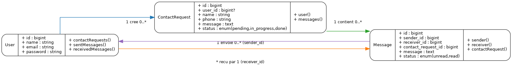
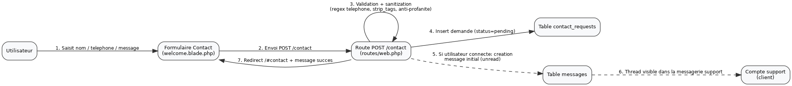
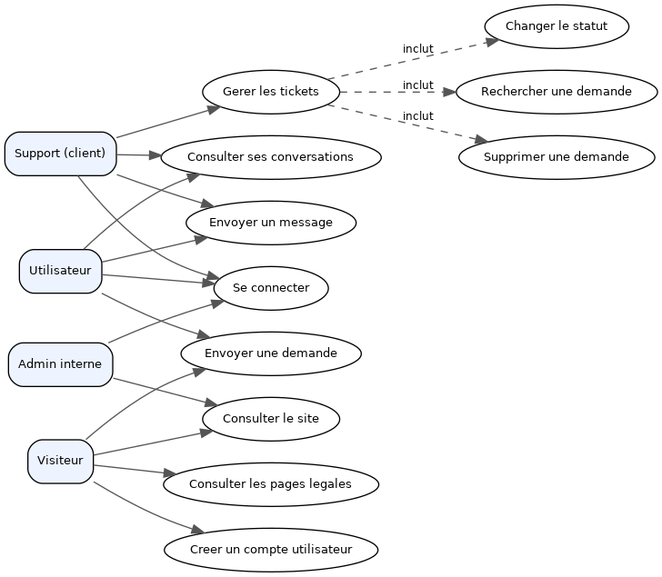

# Diagrammes UML (PNG)

Les diagrammes ont ete generes au format PNG et stockes dans `docs/diagrammes/`.

## Diagramme de classe


## Diagramme de sequence


## Diagramme de cas d utilisation


## Sources
- `docs/diagrammes/sources/diagramme-classe.dot`
- `docs/diagrammes/sources/diagramme-sequence.dot`
- `docs/diagrammes/sources/diagramme-utilisation.dot`

## Regeneration
```bash
dot -Tpng docs/diagrammes/sources/diagramme-classe.dot -o docs/diagrammes/diagramme-classe.png
dot -Tpng docs/diagrammes/sources/diagramme-sequence.dot -o docs/diagrammes/diagramme-sequence.png
dot -Tpng docs/diagrammes/sources/diagramme-utilisation.dot -o docs/diagrammes/diagramme-utilisation.png
```
